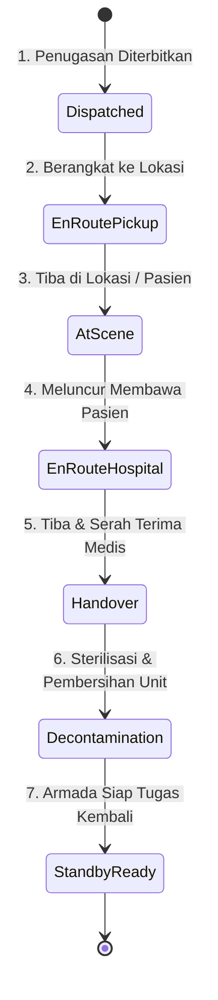

# Blueprint Arsitektur & Rencana Pengembangan Lanjutan: Modul Ekspedisi Ambulans (JCI-Ready HIS)

Dokumen ini memuat analisis arsitektur mendalam, kesenjangan sistem (*gap analysis*), serta rencana strategis (*roadmap*) pengembangan modul **Ekspedisi Ambulans IGD** untuk peningkatan skala menjadi sistem gawat darurat rumah sakit berstandar **Joint Commission International (JCI)** dan interoperabilitas sistem kesehatan modern.

Disusun dan dicatat untuk persiapan implementasi korporasi di masa depan apabila sewaktu-waktu dibutuhkan.

---

## 1. Analisis Kesenjangan & Standar Joint Commission International (JCI)

Modul operasional saat ini telah berhasil mencatat log kegiatan dasar, filter pencarian, visualisasi peta tujuan, serta ekspor laporan bulanan resmi (Excel 13 kolom & PDF). Namun, untuk naik kelas menjadi sistem enterprise rumah sakit berstandar akreditasi internasional, modul ini perlu bertransformasi dari sekadar **"Pencatat Riwayat Pasca-Kejadian" (*Post-Event Logbook*)** menjadi **"Emergency Dispatch, Patient Safety & Fleet Governance System"**.

### A. Sasaran Keselamatan Pasien & Tata Kelola Klinis (JCI IPSG & COP.3)
1. **Tim Medis Pendamping (*Clinical Escort Personnel*):**
   * *Kebutuhan:* Ambulans gawat darurat bukan sekadar taksi transportasi. Perpindahan pasien berisiko tinggi wajib mencatat kualifikasi tim medis:
     * **Dokter Pendamping** (dengan sertifikasi ATLS / ACLS).
     * **Perawat Pendamping** (dengan sertifikasi BTCLS / Emergency Nursing).
     * **Driver / Paramedik Lapangan**.
2. **Derajat Kegawatan Pasien (*Patient Transfer Acuity Level*):**
   * *Kebutuhan:* Klasifikasi tingkat keparahan pasien saat proses rujukan / penjemputan:
     * **Level 0:** Pasien stabil / administrasi / transport non-urgent.
     * **Level 1:** Pasien dengan pemantauan tanda vital berkala.
     * **Level 2:** Pasien ketergantungan alat bantu (misal: infus obat inotropik/vasopresor, oksigen masker tinggi).
     * **Level 3:** Pasien kritis / ventilasi mekanik / resusitasi aktif (memerlukan dokter spesialis/anestesi).
3. **Dokumentasi Serah Terima SBAR & Pemantauan TTV (*Vital Signs Tracking*):**
   * *Kebutuhan:* Pencatatan Tanda-Tanda Vital (TTV: Tekanan Darah, Nadi, Laju Napas, Saturasi SpO2, Skala Nyeri, GCS) pada 2 titik kritis:
     * **Pre-Departure Vitals** (Saat pasien dinaikkan ke ambulans).
     * **Arrival/Handover Vitals** (Saat serah terima di RS rujukan/ruang perawatan tujuan).
   * Verifikasi digital serah terima medis (formulir SBAR digital) dengan tanda tangan elektronik perawat penerima.

---

## 2. Tata Kelola Kesiapan Armada & Fasilitas (JCI FMS.7 - Facility Management & Safety)

1. **Pemeriksaan Kesiapan Armada Harian (*Daily Ambulance Pre-Trip Checklist*):**
   * Verifikasi digital per pergantian shift / sebelum penugasan darurat:
     * **Kesiapan Medis:** Tekanan tabung oksigen utama & portable (Bar/PSI), fungsi alat suction elektrik, baterai defibrillator/AED & monitor EKG, kelengkapan tas emergensi (*airway kit*), serta tanggal kedaluwarsa obat resusitasi.
     * **Kesiapan Kendaraan:** Ketinggian bahan bakar (BBM), tekanan ban, oli mesin, air radiator, sirine darurat, dan lampu strobo (*rotary light*).
2. **Pencatatan Odometer Valid (KM Awal vs KM Akhir):**
   * Menghindari input perkiraan manual. Jarak tempuh dihitung otomatis:
     $$\text{Jarak Tempuh (KM)} = \text{Odometer Selesai} - \text{Odometer Mulai}$$
   * Data ini secara otomatis memicu notifikasi berkala: *Jadwal Servis Rutin*, *Ganti Oli*, dan *Peremajaan Ban* armada.
3. **Log Operasional Lapangan (BBM, Tol, & Parkir):**
   * Fitur unggah foto struk dan nominal pengeluaran darurat pengemudi selama rujukan luar kota untuk keperluan rekonsiliasi kasir dan bagian keuangan rumah sakit.

---

## 3. Desain Siklus Hidup Penugasan (*Live Dispatch State Machine*)

Alih-alih mengisi waktu mulai dan selesai secara bersamaan setelah perjalanan usai, sistem dirancang mendukung pelacakan langsung (*live mission state*) oleh koordinator IGD:



### Fitur *One-Tap Geo-Timestamping* (Mobile Ergonomics 2026):
Petugas ambulans di dalam mobil yang bergerak cepat cukup menekan 1 tombol besar di ponsel:
* Tombol **"Berangkat"** $\rightarrow$ merekam `startTime` & geo-koordinat GPS otomatis.
* Tombol **"Tiba di Tempat"** $\rightarrow$ merekam timestamp lokasi penjemputan.
* Tombol **"Pasien Masuk Unit"** $\rightarrow$ memicu checklist TTV pre-transfer.
* Tombol **"Selesai & Kembali"** $\rightarrow$ merekam `endTime` & kalkulasi durasi aktual.

---

## 4. Rekomendasi Struktur Data Firestore (Scalable Schema)

```typescript
// Proposed Schema: ambulance_expeditions (Enterprise Scalable)
interface EnterpriseAmbulanceExpedition {
  id: string;
  expeditionNumber: string; // Format: AMB-YYYYMMDD-XXX
  date: string; // YYYY-MM-DD
  activityType: AmbulanceActivityType;
  acuityLevel?: 'Level 0' | 'Level 1' | 'Level 2' | 'Level 3';

  // Armada & Kru
  ambulanceId: string;
  ambulanceName: string;
  driverId: string;
  driverName: string;
  escortDoctor?: { id: string; name: string; sip: string };
  escortNurse?: { id: string; name: string; str: string };

  // Pasien & Rekam Medis (Terhubung ke Master Pasien HIS)
  patientId?: string;
  patientName: string;
  medicalRecordNumber: string;
  patientGender?: 'L' | 'P';
  patientAge?: string;

  // Status Siklus & Waktu
  status: 'Dispatched' | 'EnRoutePickup' | 'AtScene' | 'EnRouteHospital' | 'Handover' | 'Decontamination' | 'Completed' | 'Cancelled';
  cancellationReason?: string;
  timestamps: {
    dispatchedAt?: string;
    departedAt?: string;
    arrivedSceneAt?: string;
    departedSceneAt?: string;
    arrivedHospitalAt?: string;
    completedAt?: string;
  };
  durationMinutes: number;

  // Odometer & Jarak
  odometerStart?: number;
  odometerEnd?: number;
  distanceKm: number;

  // Pemantauan Klinis Sederhana (JCI COP)
  clinicalHandover?: {
    preVitals?: { bp: string; hr: number; rr: number; spo2: number; gcs: string };
    postVitals?: { bp: string; hr: number; rr: number; spo2: number; gcs: string };
    receivingFacility?: string;
    receiverName?: string;
    notes?: string;
  };

  // Keuangan / Billing
  billingStatus?: 'Unbilled' | 'Billed' | 'Complimentary' | 'InsuranceClaimed';
  estimatedCost?: number;

  // Lokasi & Navigasi
  destination: string;
  destinationLat?: number;
  destinationLng?: number;

  // Audit Trail Immutable
  createdAt: unknown;
  createdBy: string;
  createdByName: string;
  updatedAt: unknown;
  updatedBy: string;
}
```

---

## 5. Strategi & Arsitektur Pelacakan Armada Tanpa Intervensi Pengemudi (*Zero-Touch / Autonomous Telemetry*)

### A. Latar Belakang & Tantangan Lapangan (*Operational Challenge*)
Dalam operasional harian IGD rumah sakit:
1. **Pola Input Pasca-Perjalanan (*Post-Trip Logbook*):** Pengemudi/kru ambulans umumnya baru mengisi rincian formulir ekspedisi di aplikasi mobile *setelah* seluruh penugasan selesai dan mobil telah kembali terparkir di posko IGD.
2. **Fokus Keselamatan Mengemudi (*Zero Driver Distraction*):** Selama perjalanan berlangsung (terutama penjemputan darurat pasien kritis atau rujukan antar-rumah sakit), pengemudi wajib berkonsentrasi penuh pada keselamatan kemudi dan sirene jalan raya. Menuntut pengemudi membuka aplikasi ponsel sambil menyetir melanggar asas keselamatan kerja (*Occupational Safety*).
3. **Kebutuhan Visibilitas Posisi Real-Time di IGD (*Live Dispatch Visibility*):** Dokter jaga, kepala perawat triage IGD, dan koordinator armada sangat membutuhkan informasi lokasi langsung (*live GPS position*) armada secara akurat di layar web admin backend untuk memperkirakan waktu kedatangan (*Estimated Time of Arrival / ETA*), menyiapkan ruang resusitasi, serta memberikan kepastian informasi kepada keluarga pasien.

Oleh karena itu, sistem dirancang untuk mendukung pelacakan posisi secara mandiri dan hening tanpa memerlukan intervensi membuka aplikasi dari pengemudi di jalan.

---

### B. Tiga Tingkatan Solusi Pelacakan (*3-Tier Implementation Strategy*)

Berikut adalah 3 opsi arsitektur teknis yang dapat diadopsi, mulai dari solusi cepat sementara (*quick-win*) hingga solusi permanen standar industri rumah sakit enterprise:

#### 1. Opsi 1: Dedicated Dashboard Device (Ponsel/Tablet Khusus Standby di Kabin Armada)
* **Konsep:** Setiap unit ambulans (`EVALIA`, `BSI`, `PHC`) dipasangi 1 unit smartphone atau tablet Android terjangkau (entry-level, Rp 1.000.000 - Rp 1.500.000) yang terpasang permanen pada *heavy-duty car holder* di dashboard kendaraan.
* **Mekanisme Catu Daya & Otomasi:**
  * Ponsel terhubung kabel pengisi daya (USB charger) ke soket pemantik api (*lighter socket*) atau port ACC mobil.
  * Begitu kunci kontak ambulans diputar ke posisi **ACC ON** atau mesin dinyalakan, daya listrik mengalir ke ponsel.
  * Aplikasi pelacak mendeteksi status *Power Connected* (atau menggunakan automasi seperti *Tasker / Android Broadcast Intent*) untuk otomatis menghidupkan layar dan menjalankan layanan pemancar GPS di latar belakang.
  * Telemetri lokasi dikirimkan hening ke koleksi Firestore `ambulance_live_locations/{ambulanceId}` setiap 10–15 detik.
  * Begitu mesin mati (kontak OFF), aplikasi mendeteksi hilangnya catu daya dan memperbarui status armada menjadi `Standby / Parkir di Posko`.
* **Kelebihan:**
  * Pengemudi sama sekali tidak perlu menyentuh ponsel pribadi atau membuka aplikasi saat bertugas.
  * Identitas armada (`ambulanceId`) selalu 100% konsisten sesuai fisik mobil tempat gawai terpasang.
  * Gawai dapat difungsikan ganda di masa depan sebagai layar navigasi rute rujukan Google Maps/OSM atau monitor pemanggilan darurat (*dispatch paging*).
* **Pertimbangan & Mitigasi:**
  * Membutuhkan 3 unit gawai Android cadangan dan kartu perdana kuota internet bulanan khusus armada (~Rp 25.000/bln/unit).
  * Diperlukan holder berkualitas kokoh tahan getaran dan penempatan yang terlindung dari paparan terik matahari langsung saat parkir.

---

#### 2. Opsi 2: Persistent Background Foreground Service dengan Auto-Start on Boot (Ponsel Pengemudi)
* **Konsep:** Peningkatan kapabilitas aplikasi Flutter supir agar layanan telemetri lokasi (`LocationTrackingService`) dapat hidup mandiri di sistem operasi Android pengemudi tanpa pengemudi harus membuka antarmuka aplikasi.
* **Mekanisme Arsitektur:**
  * Mengadopsi library native service persisten seperti `flutter_foreground_task` atau `workmanager` yang dipadukan dengan izin manifest:
    * `RECEIVE_BOOT_COMPLETED` (otomatis aktif saat ponsel dihidupkan ulang).
    * `FOREGROUND_SERVICE_LOCATION` & `ACCESS_BACKGROUND_LOCATION` (pelacakan latar belakang presisi tinggi).
    * `WAKE_LOCK` (mencegah proses ditidurkan oleh CPU saat layar ponsel padam).
  * Service berjalan di latar belakang dengan menampilkan notifikasi hening persisten (*ongoing silent notification*) di tray notifikasi Android: *"Sistem Pemantauan Armada Primaya IGD Aktif"*.
  * Konfigurasi Pengaturan Perangkat (One-Time Setup):
    * Mengaktifkan *Auto-Start Permission* pada pengaturan OS Android (terutama ponsel Xiaomi MIUI/HyperOS, Oppo ColorOS, Vivo FuntouchOS).
    * Menonaktifkan pembatasan baterai (*Battery Saver: Unrestricted / Tanpa Batasan*).
* **Kelebihan:**
  * **Biaya Perangkat Nol (Rp 0):** Tidak memerlukan pengadaan perangkat keras baru karena memanfaatkan ponsel Android yang telah dimiliki supir/petugas ambulans.
  * Sepenuhnya diimplementasikan melalui pembaruan kode aplikasi Flutter.
* **Pertimbangan & Mitigasi:**
  * Masih memiliki ketergantungan pada disiplin pengemudi (ponsel harus dalam kondisi menyala, baterai terisi, dan GPS aktif).
  * Sistem operasi Android modern memiliki algoritma manajemen memori (*Doze Mode*) yang agresif; jika tidak diatur dengan benar, service pelacakan dapat dihentikan sepihak oleh OS.

---

#### 3. Opsi 3: Standalone Hardware GPS Tracker Mandiri (OBD-II / Aki Mobil - Standar Industri HIS Enterprise)
* **Konsep:** Menggunakan perangkat keras GPS Tracker mandiri (*automotive-grade IoT device*) yang terpasang langsung pada sistem kelistrikan kendaraan ambulans.
* **Tipe Perangkat yang Direkomendasikan:**
  * **Tipe A (Plug & Play OBD-II):** Contoh: *SinoTrack ST-902 OBD*, *Concox OB22*, atau *Teltonika FMB003*. Dicolokkan langsung ke soket port OBD-II (terletak di bawah dashboard dekat setir pengemudi). Pemasangan membutuhkan waktu kurang dari 1 menit tanpa memotong kabel kendaraan.
  * **Tipe B (Hardwired ke Aki & Kontak ACC):** Contoh: *SinoTrack ST-901 / ST-906* atau *Concox WeTrack2*. Dipasang tersembunyi di ruang mesin/dasbor dengan sensor deteksi status kunci kontak (*Ignition Sense*).
* **Mekanisme Kerja & Integrasi Backend:**
  * Perangkat GPS tracker dilengkapi kartu SIM IoT/M2M (misal: *Telkomsel IoT / Indosat M2M*, paket data hemat ~Rp 15.000 – Rp 25.000/bulan).
  * Perangkat memancarkan paket data telemetri (koordinat latitude/longitude, arah derajat *heading*, kecepatan km/jam, status kontak mesin ON/OFF, voltase aki) melalui protokol TCP/UDP/HTTP.
  * **Integrasi ke Firestore:**
    * Menggunakan server forwarder (seperti *Traccar Open Source GPS Server* pada VPS kecil, atau langsung webhook HTTP ke Firebase Cloud Function).
    * Cloud Function memetakan payload GPS perangkat secara otomatis dan langsung memperbarui dokumen Firestore:
      `ambulance_live_locations/{ambulanceId}`.
    * Modal pemantauan peta di web admin dashboard (`AmbulanceLiveTrackingModal.tsx`) langsung menampilkan posisi bergerak ambulans secara real-time tanpa perbedaan teknis.
* **Kelebihan (Standar Terbaik Rumah Sakit):**
  * **100% Otonom & Zero Human Dependency:** Pelacakan aktif 24 jam sehari, 7 hari seminggu tanpa bergantung pada ada/tidaknya pengemudi, aplikasi supir dibuka atau tidak, atau baterai ponsel habis.
  * **Akurasi & Keandalan Sangat Tinggi:** Menggunakan modul antena GPS fisik khusus otomotif dengan penerimaan satelit multi-GNSS (GPS, GLONASS, Galileo) yang jauh lebih kuat dibanding antena ponsel.
  * **Fitur Tambahan Canggih:** Mampu memantau kesehatan baterai aki mobil (peringatan voltase aki lemah sebelum mogok), sensor benturan/kecelakaan (*crash detection*), dan batas area operasional (*geofencing alarm*).
* **Pertimbangan & Biaya:**
  * Biaya pengadaan alat sangat terjangkau: Rp 200.000 – Rp 450.000 per unit mobil.
  * Biaya langganan kartu SIM IoT: ~Rp 20.000/bulan per armada.

---

### C. Matriks Komparasi Ketiga Strategi

| Parameter Evaluasi | Opsi 1: Dedicated Dashboard Device | Opsi 2: Persistent App Service | Opsi 3: Hardware GPS Tracker (OBD-II/Aki) |
| :--- | :--- | :--- | :--- |
| **Ketergantungan Kru Lapangan** | **Sangat Rendah** (Otomatis saat kontak mobil ON) | **Sedang** (Tergantung HP supir menyala & GPS ON) | **NOL / 100% Otonom** (Bekerja mandiri tanpa manusia) |
| **Biaya Investasi Awal** | Rendah (~Rp 1 - 1,5 Jt / unit HP) | **Nol Rupiah (Rp 0)** | Sangat Terjangkau (~Rp 200 - 450 Rb / unit) |
| **Biaya Operasional Bulanan** | ~Rp 25.000 / bln / armada (Paket Data) | Rp 0 (Menggunakan kuota supir) | ~Rp 15.000 - 25.000 / bln / armada (SIM IoT) |
| **Stabilitas & Reliabilitas** | Baik (Risiko kepanasan jika parkir terik) | Cukup (Bisa dibunuh oleh OS Android *Doze*) | **Sangat Tinggi (Automotive Grade)** |
| **Kecepatan Implementasi** | Cepat (Pasang holder & jalankan app) | Memerlukan update kode native service | Sangat Cepat (Tinggal colok OBD-II + Cloud Function) |
| **Kepatuhan Audit JCI FMS** | Menengah | Menengah | **Tinggi (Standar Manajemen Fasilitas Armada)** |

---

### D. Rekomendasi Rencana Aksi Bertahap (*Actionable Recommendation*)

1. **Tahap Sementara (Quick Win):**
   * Terapkan kombinasi **Opsi 1** (menyediakan 1 ponsel standby di ambulans utama) atau penyempurnaan **Opsi 2** (menjadikan `LocationTrackingService` di ponsel Flutter supir tetap berjalan di background melalui notifikasi hening).
   * Kru tetap menggunakan aplikasi untuk mengisi log ekspedisi setelah selesai perjalanan, namun telemetri lokasi armada telah terkirim secara otomatis saat mobil bergerak.
2. **Tahap Permanen & Skala Enterprise (Rekomendasi Utama Masa Depan):**
   * Mengadopsi **Opsi 3 (Hardware GPS Tracker OBD-II / Aki)** untuk seluruh unit ambulans Primaya Hospital (`EVALIA`, `BSI`, `PHC`).
   * Mengintegrasikan server GPS dengan endpoint Firebase Cloud Function untuk menyuplai koleksi `ambulance_live_locations` secara terpusat.
   * Aplikasi mobile supir murni difokuskan untuk tugas klinis dan pelaporan administratif: pencatatan pasien, tanda tangan SBAR, dan checklist kesiapan medis.

---

## 6. Roadmap Implementasi Bertahap

| Fase | Fokus Pengembangan | Manfaat Utama |
| :---: | :--- | :--- |
| **Fase 1** | Form Input Tim Pendamping Medis (Dokter & Perawat), Kategori Kegawatan, dan KM Odometer (Awal - Akhir). | Langsung memenuhi poin utama audit rekam medis transfer pasien JCI. |
| **Fase 2** | Fitur *Daily Checklist Kesiapan Ambulans* (Tabung Oksigen & Baterai AED/Suction). | Kepatuhan mutlak bab FMS (Keselamatan Fasilitas & Alat Medik). |
| **Fase 3** | Siklus Status Misi Real-Time (*State Machine*) dengan Tombol *One-Tap Timestamp* pada tampilan mobile supir/perawat. | Efisiensi input lapangan, koordinator IGD memantau posisi armada secara live. |
| **Fase 4** | **Zero-Touch GPS Fleet Telemetry**: Integrasi Hardware GPS Tracker OBD-II / Dedicated Kabin Device langsung ke Firebase Cloud Functions & Firestore. | Pelacakan posisi armada 100% otonom tanpa membebani konsentrasi kemudi supir di jalan. |
| **Fase 5** | Integrasi Billing Kasir, Master Pasien Terpusat (HIS), dan Pelacakan Rute Otomatis (Maps Routing API). | Integrasi menyeluruh tanpa re-entry data pasien dan transparansi pendapatan operasional. |

---

### Catatan Pengesahan Dokumen:

Rancangan arsitektur dan rekomendasi di atas didokumentasikan sebagai pedoman teknis resmi sistem gawat darurat. Implementasi dapat dilakukan secara bertahap saat korporasi siap melakukan ekspansi dan standardisasi akreditasi.

Tertanda,  
**Roby Viori Fansya**

