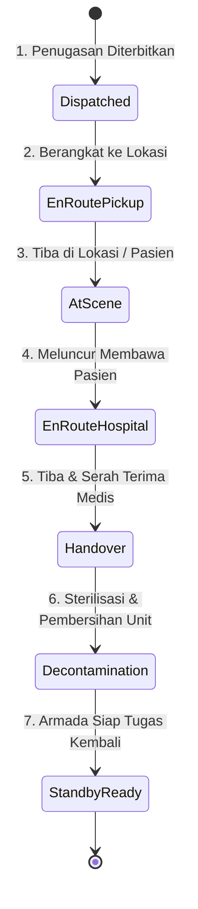

# Blueprint Arsitektur & Rencana Pengembangan Lanjutan: Modul Ekspedisi Ambulans (JCI-Ready HIS)

Dokumen ini memuat analisis arsitektur mendalam, kesenjangan sistem (*gap analysis*), serta rencana strategis (*roadmap*) pengembangan modul **Ekspedisi Ambulans IGD** untuk peningkatan skala menjadi sistem gawat darurat rumah sakit berstandar **Joint Commission International (JCI)** dan interoperabilitas sistem kesehatan modern.

Disusun dan dicatat untuk persiapan implementasi korporasi di masa depan apabila sewaktu-waktu dibutuhkan.

---

## 1. Analisis Kesenjangan & Standar Joint Commission International (JCI)

Modul operasional saat ini telah berhasil mencatat log kegiatan dasar, filter pencarian, visualisasi peta tujuan, serta ekspor laporan bulanan resmi (Excel 13 kolom & PDF). Namun, untuk naik kelas menjadi sistem enterprise rumah sakit berstandar akreditasi internasional, modul ini perlu bertransformasi dari sekadar **"Pencatat Riwayat Pasca-Kejadian" (*Post-Event Logbook*)** menjadi **"Emergency Dispatch, Patient Safety & Fleet Governance System"**.

### A. Sasaran Keselamatan Pasien & Tata Kelola Klinis (JCI IPSG & COP.3)
1. **Tim Medis Pendamping (*Clinical Escort Personnel*):**
   * *Kebutuhan:* Ambulans gawat darurat bukan sekadar taksi transportasi. Perpindahan pasien berisiko tinggi wajib mencatat kualifikasi tim medis:
     * **Dokter Pendamping** (dengan sertifikasi ATLS / ACLS).
     * **Perawat Pendamping** (dengan sertifikasi BTCLS / Emergency Nursing).
     * **Driver / Paramedik Lapangan**.
2. **Derajat Kegawatan Pasien (*Patient Transfer Acuity Level*):**
   * *Kebutuhan:* Klasifikasi tingkat keparahan pasien saat proses rujukan / penjemputan:
     * **Level 0:** Pasien stabil / administrasi / transport non-urgent.
     * **Level 1:** Pasien dengan pemantauan tanda vital berkala.
     * **Level 2:** Pasien ketergantungan alat bantu (misal: infus obat inotropik/vasopresor, oksigen masker tinggi).
     * **Level 3:** Pasien kritis / ventilasi mekanik / resusitasi aktif (memerlukan dokter spesialis/anestesi).
3. **Dokumentasi Serah Terima SBAR & Pemantauan TTV (*Vital Signs Tracking*):**
   * *Kebutuhan:* Pencatatan Tanda-Tanda Vital (TTV: Tekanan Darah, Nadi, Laju Napas, Saturasi SpO2, Skala Nyeri, GCS) pada 2 titik kritis:
     * **Pre-Departure Vitals** (Saat pasien dinaikkan ke ambulans).
     * **Arrival/Handover Vitals** (Saat serah terima di RS rujukan/ruang perawatan tujuan).
   * Verifikasi digital serah terima medis (formulir SBAR digital) dengan tanda tangan elektronik perawat penerima.

---

## 2. Tata Kelola Kesiapan Armada & Fasilitas (JCI FMS.7 - Facility Management & Safety)

1. **Pemeriksaan Kesiapan Armada Harian (*Daily Ambulance Pre-Trip Checklist*):**
   * Verifikasi digital per pergantian shift / sebelum penugasan darurat:
     * **Kesiapan Medis:** Tekanan tabung oksigen utama & portable (Bar/PSI), fungsi alat suction elektrik, baterai defibrillator/AED & monitor EKG, kelengkapan tas emergensi (*airway kit*), serta tanggal kedaluwarsa obat resusitasi.
     * **Kesiapan Kendaraan:** Ketinggian bahan bakar (BBM), tekanan ban, oli mesin, air radiator, sirine darurat, dan lampu strobo (*rotary light*).
2. **Pencatatan Odometer Valid (KM Awal vs KM Akhir):**
   * Menghindari input perkiraan manual. Jarak tempuh dihitung otomatis:
     $$\text{Jarak Tempuh (KM)} = \text{Odometer Selesai} - \text{Odometer Mulai}$$
   * Data ini secara otomatis memicu notifikasi berkala: *Jadwal Servis Rutin*, *Ganti Oli*, dan *Peremajaan Ban* armada.
3. **Log Operasional Lapangan (BBM, Tol, & Parkir):**
   * Fitur unggah foto struk dan nominal pengeluaran darurat pengemudi selama rujukan luar kota untuk keperluan rekonsiliasi kasir dan bagian keuangan rumah sakit.

---

## 3. Desain Siklus Hidup Penugasan (*Live Dispatch State Machine*)

Alih-alih mengisi waktu mulai dan selesai secara bersamaan setelah perjalanan usai, sistem dirancang mendukung pelacakan langsung (*live mission state*) oleh koordinator IGD:



### Fitur *One-Tap Geo-Timestamping* (Mobile Ergonomics 2026):
Petugas ambulans di dalam mobil yang bergerak cepat cukup menekan 1 tombol besar di ponsel:
* Tombol **"Berangkat"** $\rightarrow$ merekam `startTime` & geo-koordinat GPS otomatis.
* Tombol **"Tiba di Tempat"** $\rightarrow$ merekam timestamp lokasi penjemputan.
* Tombol **"Pasien Masuk Unit"** $\rightarrow$ memicu checklist TTV pre-transfer.
* Tombol **"Selesai & Kembali"** $\rightarrow$ merekam `endTime` & kalkulasi durasi aktual.

---

## 4. Rekomendasi Struktur Data Firestore (Scalable Schema)

```typescript
// Proposed Schema: ambulance_expeditions (Enterprise Scalable)
interface EnterpriseAmbulanceExpedition {
  id: string;
  expeditionNumber: string; // Format: AMB-YYYYMMDD-XXX
  date: string; // YYYY-MM-DD
  activityType: AmbulanceActivityType;
  acuityLevel?: 'Level 0' | 'Level 1' | 'Level 2' | 'Level 3';

  // Armada & Kru
  ambulanceId: string;
  ambulanceName: string;
  driverId: string;
  driverName: string;
  escortDoctor?: { id: string; name: string; sip: string };
  escortNurse?: { id: string; name: string; str: string };

  // Pasien & Rekam Medis (Terhubung ke Master Pasien HIS)
  patientId?: string;
  patientName: string;
  medicalRecordNumber: string;
  patientGender?: 'L' | 'P';
  patientAge?: string;

  // Status Siklus & Waktu
  status: 'Dispatched' | 'EnRoutePickup' | 'AtScene' | 'EnRouteHospital' | 'Handover' | 'Decontamination' | 'Completed' | 'Cancelled';
  cancellationReason?: string;
  timestamps: {
    dispatchedAt?: string;
    departedAt?: string;
    arrivedSceneAt?: string;
    departedSceneAt?: string;
    arrivedHospitalAt?: string;
    completedAt?: string;
  };
  durationMinutes: number;

  // Odometer & Jarak
  odometerStart?: number;
  odometerEnd?: number;
  distanceKm: number;

  // Pemantauan Klinis Sederhana (JCI COP)
  clinicalHandover?: {
    preVitals?: { bp: string; hr: number; rr: number; spo2: number; gcs: string };
    postVitals?: { bp: string; hr: number; rr: number; spo2: number; gcs: string };
    receivingFacility?: string;
    receiverName?: string;
    notes?: string;
  };

  // Keuangan / Billing
  billingStatus?: 'Unbilled' | 'Billed' | 'Complimentary' | 'InsuranceClaimed';
  estimatedCost?: number;

  // Lokasi & Navigasi
  destination: string;
  destinationLat?: number;
  destinationLng?: number;

  // Audit Trail Immutable
  createdAt: unknown;
  createdBy: string;
  createdByName: string;
  updatedAt: unknown;
  updatedBy: string;
}
```

---

## 5. Roadmap Implementasi Bertahap

| Fase | Fokus Pengembangan | Manfaat Utama |
| :---: | :--- | :--- |
| **Fase 1** | Form Input Tim Pendamping Medis (Dokter & Perawat), Kategori Kegawatan, dan KM Odometer (Awal - Akhir). | Langsung memenuhi poin utama audit rekam medis transfer pasien JCI. |
| **Fase 2** | Fitur *Daily Checklist Kesiapan Ambulans* (Tabung Oksigen & Baterai AED/Suction). | Kepatuhan mutlak bab FMS (Keselamatan Fasilitas & Alat Medik). |
| **Fase 3** | Siklus Status Misi Real-Time (*State Machine*) dengan Tombol *One-Tap Timestamp* pada tampilan mobile supir/perawat. | Efisiensi input lapangan, koordinator IGD memantau posisi armada secara live. |
| **Fase 4** | Integrasi Billing Kasir, Master Pasien Terpusat (HIS), dan Pelacakan Rute Otomatis (Maps Routing API). | Integrasi menyeluruh tanpa re-entry data pasien dan transparansi pendapatan operasional. |

---

### Catatan Pengesahan Dokumen:

Rancangan arsitektur dan rekomendasi di atas didokumentasikan sebagai pedoman teknis resmi sistem gawat darurat. Implementasi dapat dilakukan secara bertahap saat korporasi siap melakukan ekspansi dan standardisasi akreditasi.

Tertanda,  
**Roby Viori Fansya**
